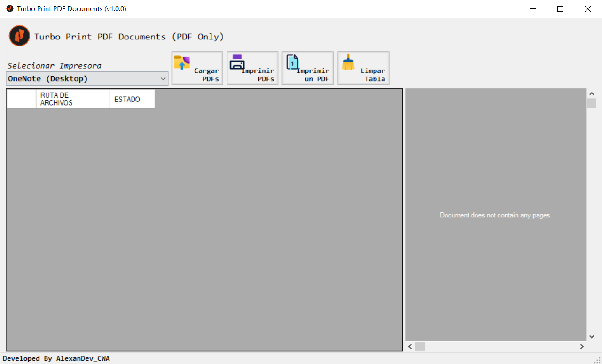

# TurboPrint PDF Documents
Herramienta construida en .NET Framework para la impresión de múltiples archivos .PDF, la herramienta cuenta con la funcionalidad de impresión de múltiples documentos con un solo clic, enviar a imprimir solamente un documento, obtener una preview del documento para saber cuál se está enviando a imprimir.

## Preview

